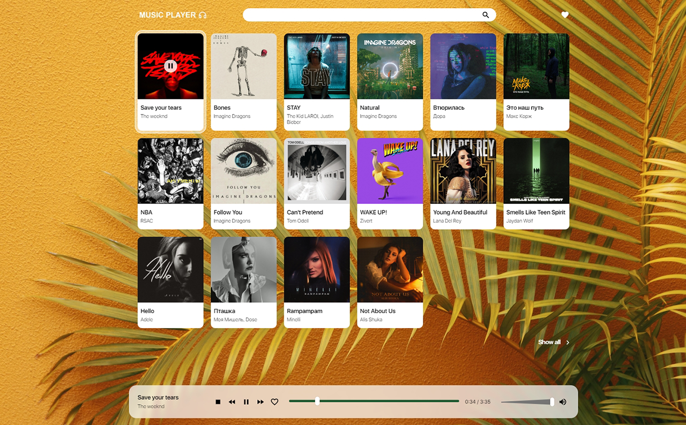

# MUSIC PLAYER



## Getting started

```
$ git clone https://github.com/muteki-Ronin/music-player
$ cd api-music
$ run api server - node index (in terminal)
$ cd music-player
$ run live-server
$ play music :-)
```
